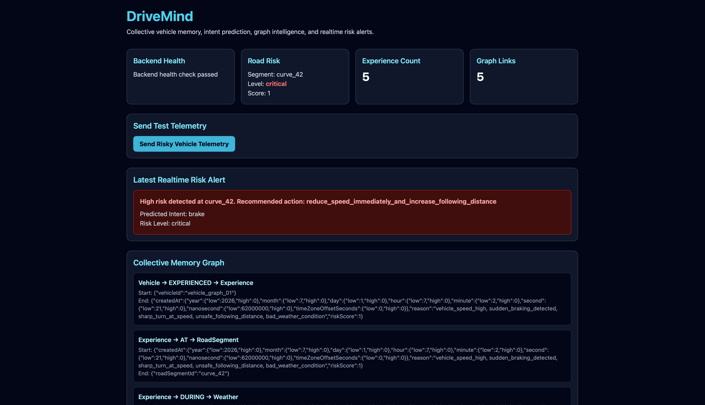

# DriveMind

**Collective Memory and Intent Prediction System for Intelligent Vehicles**

DriveMind is an AI-powered intelligent vehicle system that allows vehicles to learn from driving experiences and share useful safety knowledge with other vehicles.

Instead of sharing raw sensor data, DriveMind stores and shares structured driving experiences such as risky turns, sudden braking events, low visibility zones, and near-miss situations.

The project combines:

- Vehicle telemetry simulation
- AI-based driver/vehicle intent prediction
- Risk scoring
- Collective experience memory
- Real-time alerts
- Graph-based road knowledge using Neo4j
- React dashboard for visualization

---

## Project Goal

Modern intelligent vehicles usually make decisions using only their own sensors and local environment.

DriveMind extends this idea by giving vehicles a form of collective memory.

When one vehicle experiences a dangerous situation on a road segment, that experience is stored and can help future vehicles understand risk before they reach the same location.

---

## Key Idea

DriveMind does not simply store raw vehicle data.

It converts driving situations into structured experience memory.

Example:

```json
{
  "vehicleId": "vehicle_01",
  "roadSegmentId": "curve_42",
  "eventType": "high_risk_driving",
  "reason": "sudden_braking, sharp_turn_risk, near_miss, bad_weather",
  "riskScore": 0.9,
  "recommendedAction": "Immediate braking or avoidance required"
}
```

This experience becomes part of a shared memory system that other vehicles can use.

---

## Features

### 1. Vehicle Telemetry Ingestion

The backend accepts vehicle telemetry such as:

- Vehicle ID
- Road segment ID
- Speed
- Acceleration
- Brake pressure
- Steering angle
- Lane offset
- Distance from front vehicle
- Weather condition

---

### 2. AI Intent Prediction

The AI service predicts the likely intent of the vehicle using telemetry input.

Possible predictions include:

- Keep lane
- Brake
- Turn
- Change lane

The current model is trained on synthetic simulation data for MVP demonstration.

> Note: The current AI model is a prototype trained on synthetic data. It is not claimed to represent real-world vehicle performance. Future versions can use CARLA simulation or real-world trajectory datasets.

---

### 3. Risk Scoring Engine

The backend calculates a driving risk score based on vehicle behavior and environment.

Risk factors include:

- High speed
- Sudden braking
- Sharp steering
- Close following distance
- Rain or fog
- Low visibility

Risk levels:

- Low
- Medium
- High
- Critical

---

### 4. Collective Experience Memory

If a risky situation is detected, DriveMind stores it as an experience.

Each experience includes:

- Vehicle involved
- Road segment
- Weather
- Event type
- Risk score
- Recommended action
- Reason for risk

---

### 5. Real-Time Risk Alerts

DriveMind uses Socket.IO to send real-time alerts to the dashboard when a high-risk event is detected.

This allows the frontend to immediately show alerts without refreshing the page.

---

### 6. Neo4j Graph Memory

DriveMind stores road experiences as graph relationships.

Example graph structure:

```text
Vehicle → EXPERIENCED → Experience
Experience → AT → RoadSegment
Experience → DURING → Weather
Experience → TYPE → Event
Experience → SUGGESTS → Action
```

This makes it possible to analyze relationships between vehicles, roads, weather, and driving risks.

---

### 7. React Dashboard

The frontend dashboard displays:

- Backend health status
- Road risk summary
- Total stored experiences
- Latest real-time alert
- Collective memory graph overview
- Experience memory records
- Button to simulate risky vehicle telemetry

---

## Demo

A demo video or GIF can be added inside:

```text
docs/demo/
```

Recommended demo flow:

1. Start MongoDB and Neo4j
2. Start AI service
3. Start backend
4. Start frontend
5. Open dashboard
6. Click `Send Risky Vehicle Telemetry`
7. Show real-time alert, AI prediction, risk score, and graph memory update

Presentation notes are available here:

```text
docs/presentation/hackathon-pitch.md
```

---

## Dashboard



The dashboard is available at:

```text
http://localhost:5173
```

Dashboard sections:

- Backend Health
- Road Risk
- Experience Count
- Latest Risk Alert
- Collective Memory Graph
- Experience Memory
- Simulated risky telemetry button

---

## Project Documentation

Additional project documentation:

```text
PROJECT_SUMMARY.md
docs/project-status.md
docs/ROADMAP.md
docs/presentation/hackathon-pitch.md
docs/architecture/system-diagram.md
docs/architecture/system-logic.md
```

---

## Tech Stack

### Frontend

- React
- Vite
- Tailwind CSS
- Socket.IO Client

### Backend

- Node.js
- Express.js
- Socket.IO
- MongoDB
- Mongoose
- Neo4j Driver
- Axios

### AI Service

- Python
- FastAPI
- Scikit-learn
- Pandas
- NumPy
- Joblib
- Uvicorn

### Databases

- MongoDB
- Neo4j

### DevOps

- Docker
- Docker Compose
- GitHub

---

## Project Structure

```text
DriveMind/
│
├── ai-service/
│   ├── app/
│   │   ├── main.py
│   │   └── train_model.py
│   ├── data/
│   │   └── generate_intent_data.py
│   ├── models/
│   └── requirements.txt
│
├── backend/
│   ├── src/
│   │   ├── config/
│   │   │   ├── db.js
│   │   │   └── neo4j.js
│   │   ├── controllers/
│   │   ├── models/
│   │   ├── routes/
│   │   ├── services/
│   │   └── server.js
│   ├── package.json
│   ├── .env
│   └── .env.example
│
├── frontend/
│   ├── src/
│   │   ├── api/
│   │   ├── pages/
│   │   ├── socket/
│   │   ├── App.jsx
│   │   └── main.jsx
│   ├── package.json
│   └── vite.config.js
│
├── docs/
│   ├── api/
│   ├── architecture/
│   │   ├── assets/
│   │   ├── system-diagram.md
│   │   └── system-logic.md
│   ├── db/
│   ├── demo/
│   ├── ml/
│   ├── presentation/
│   │   └── hackathon-pitch.md
│   ├── ROADMAP.md
│   ├── project-status.md
│   └── screenshots/
│       └── dashboard-working.png
│
├── .github/
│   ├── ISSUE_TEMPLATE/
│   │   ├── bug_report.md
│   │   └── feature_request.md
│   └── pull_request_template.md
│
├── scripts/
│   ├── start-ai-service.sh
│   ├── start-backend.sh
│   ├── start-databases.sh
│   ├── start-frontend.sh
│   ├── test-ai-health.sh
│   ├── test-backend-health.sh
│   ├── test-full-system.sh
│   └── test-risky-telemetry.sh
│
├── CODE_OF_CONDUCT.md
├── CONTRIBUTING.md
├── LICENSE
├── PROJECT_SUMMARY.md
├── SECURITY.md
├── docker-compose.yml
├── README.md
└── .gitignore
```

---

## System Architecture

```text
Vehicle Telemetry
        |
        v
Backend API
        |
        |----> AI Service
        |        |
        |        v
        |   Intent Prediction
        |
        |----> Risk Scoring Engine
        |
        |----> MongoDB
        |        |
        |        v
        |   Experience Memory
        |
        |----> Neo4j
        |        |
        |        v
        |   Graph Knowledge Memory
        |
        |----> Socket.IO
                 |
                 v
          React Dashboard
```

Detailed system diagram notes are available here:

```text
docs/architecture/system-diagram.md
```

---

## Environment Variables

Create a `.env` file inside the `backend` folder.

You can use `backend/.env.example` as a template.

Path:

```text
backend/.env
```

Add:

```env
PORT=5001
MONGO_URI=mongodb://localhost:27017/drivemind
AI_SERVICE_URL=http://127.0.0.1:8000
NEO4J_URI=bolt://localhost:7687
NEO4J_USERNAME=neo4j
NEO4J_PASSWORD=drivemind123
```

---

## Installation

### 1. Clone the Repository

```bash
git clone https://github.com/rags-git/DriveMind.git
cd DriveMind
```

---

### 2. Install Backend Dependencies

```bash
cd backend
npm install
cd ..
```

---

### 3. Install Frontend Dependencies

```bash
cd frontend
npm install
cd ..
```

---

### 4. Set Up AI Service

```bash
cd ai-service
python3 -m venv .venv
source .venv/bin/activate
pip install -r requirements.txt
cd ..
```

---

## Running the Project

DriveMind has four main services:

1. MongoDB and Neo4j databases
2. AI service
3. Backend service
4. Frontend dashboard

Each service should be run in a separate terminal window.

---

## Quick Start Scripts

DriveMind includes startup scripts for each service.

### Start Databases

```bash
./scripts/start-databases.sh
```

This starts:

- MongoDB on `localhost:27017`
- Neo4j Browser on `http://localhost:7474`
- Neo4j Bolt on `bolt://localhost:7687`

---

### Start AI Service

```bash
./scripts/start-ai-service.sh
```

AI service runs on:

```text
http://127.0.0.1:8000
```

---

### Start Backend

```bash
./scripts/start-backend.sh
```

Backend runs on:

```text
http://localhost:5001
```

---

### Start Frontend

```bash
./scripts/start-frontend.sh
```

Frontend runs on:

```text
http://localhost:5173
```

---

## Test Scripts

Test backend health:

```bash
./scripts/test-backend-health.sh
```

Test AI service health:

```bash
./scripts/test-ai-health.sh
```

Test risky telemetry flow:

```bash
./scripts/test-risky-telemetry.sh
```

This checks the full backend flow:

- telemetry storage
- AI intent prediction
- risk scoring
- experience creation
- Neo4j graph memory creation

Test the complete DriveMind system:

```bash
./scripts/test-full-system.sh
```

This runs:

- backend health test
- AI service health test
- risky telemetry test

Expected full system test result:

```text
Backend health: OK
AI service health: OK
Model loaded: true
Predicted intent: brake
Risk level: critical
Experience created: true
Graph memory created: true
```

---

## Manual Run Commands

Use these commands if you do not want to use the scripts.

### 1. Start Databases

```bash
docker compose up -d
```

---

### 2. Start AI Service

```bash
cd ai-service
source .venv/bin/activate
uvicorn app.main:app --reload --port 8000
```

---

### 3. Start Backend

```bash
cd backend
npm run dev
```

---

### 4. Start Frontend

```bash
cd frontend
npm run dev
```

---

## Docker Services

The project uses Docker Compose for MongoDB and Neo4j.

```yml
services:
  mongodb:
    image: mongo:6.0.5
    container_name: drivemind-telemetry-db
    ports:
      - "27017:27017"

  neo4j:
    image: neo4j:5
    container_name: drivemind-neo4j
    ports:
      - "7474:7474"
      - "7687:7687"
```

Neo4j login:

```text
Username: neo4j
Password: drivemind123
```

---

## API Endpoints

### Backend Health

```http
GET /api/health
```

Example:

```bash
curl http://localhost:5001/api/health
```

---

### Send Vehicle Telemetry

```http
POST /api/telemetry
```

Example:

```bash
curl -X POST http://localhost:5001/api/telemetry \
-H "Content-Type: application/json" \
-d '{
  "vehicleId": "vehicle_graph_01",
  "roadSegmentId": "curve_42",
  "speed": 78,
  "acceleration": -1.9,
  "brakePressure": 0.88,
  "steeringAngle": 25,
  "laneOffset": 0.5,
  "distanceToFrontVehicle": 5,
  "weather": "rain"
}'
```

Expected result:

```json
{
  "intentPrediction": {
    "predictedIntent": "brake"
  },
  "risk": {
    "riskLevel": "critical"
  },
  "experienceCreated": true,
  "graphMemoryCreated": true
}
```

---

### Get Experiences

```http
GET /api/experiences
```

Example:

```bash
curl http://localhost:5001/api/experiences
```

---

### Get Road Risk Summary

```http
GET /api/road-risk/:roadSegmentId
```

Example:

```bash
curl http://localhost:5001/api/road-risk/curve_42
```

---

### Get Graph Overview

```http
GET /api/graph/overview
```

Example:

```bash
curl http://localhost:5001/api/graph/overview
```

---

## AI Service Endpoints

### AI Health

```http
GET /health
```

Example:

```bash
curl http://127.0.0.1:8000/health
```

---

### Predict Intent

```http
POST /predict-intent
```

Example:

```bash
curl -X POST http://127.0.0.1:8000/predict-intent \
-H "Content-Type: application/json" \
-d '{
  "speed": 78,
  "acceleration": -1.9,
  "brakePressure": 0.88,
  "steeringAngle": 25,
  "laneOffset": 0.5,
  "distanceToFrontVehicle": 5
}'
```

---

## Neo4j Graph Query

Open Neo4j Browser:

```text
http://localhost:7474
```

Run:

```cypher
MATCH (n)-[r]->(m)
RETURN n, r, m
LIMIT 50;
```

This shows the collective vehicle memory graph.

---

## Example Graph Memory

A risky event creates graph relationships like:

```text
(vehicle_graph_01)-[:EXPERIENCED]->(Experience)
(Experience)-[:AT]->(curve_42)
(Experience)-[:DURING]->(rain)
(Experience)-[:TYPE]->(high_risk_driving)
(Experience)-[:SUGGESTS]->(Immediate braking or avoidance required)
```

---

## Real-Time Events

DriveMind uses Socket.IO for real-time updates.

### Event Name

```text
risk-alert
```

### Example Payload

```json
{
  "vehicleId": "vehicle_graph_01",
  "roadSegmentId": "curve_42",
  "riskScore": 0.9,
  "riskLevel": "critical",
  "recommendedAction": "Immediate braking or avoidance required"
}
```

---

## Machine Learning Model

The AI model is a Random Forest classifier.

Input features:

- Speed
- Acceleration
- Brake pressure
- Steering angle
- Lane offset
- Distance to front vehicle

Output:

- Predicted vehicle intent

Current intent labels:

- keep_lane
- brake
- turn
- change_lane

The model is trained on synthetic data generated inside the project.

Current training accuracy during testing:

```text
0.9840
```

This accuracy is only for synthetic test data and should not be treated as real-world performance.

---

## Project Status

Project summary:

```text
PROJECT_SUMMARY.md
```

Current MVP status:

```text
docs/project-status.md
```

Current completion:

```text
Approximately 95% complete as a hackathon and portfolio MVP.
```

---

## Community and Governance

DriveMind includes standard GitHub community files:

- Contributing guide: `CONTRIBUTING.md`
- Code of conduct: `CODE_OF_CONDUCT.md`
- Security policy: `SECURITY.md`
- License: `LICENSE`
- Bug report template: `.github/ISSUE_TEMPLATE/bug_report.md`
- Feature request template: `.github/ISSUE_TEMPLATE/feature_request.md`
- Pull request template: `.github/pull_request_template.md`

---

## Current Limitations

- The current telemetry data is simulated.
- The AI model is trained on synthetic data.
- The project does not yet use CARLA or real vehicle datasets.
- Authentication is not added yet.
- Full production deployment is not added yet.
- Backend and AI service are not fully Dockerized yet.
- The dashboard is a prototype interface.

---

## Future Improvements

Planned improvements:

- Add CARLA simulator integration
- Use real-world trajectory datasets
- Add map-based visualization
- Add authentication
- Add full Dockerization for backend, frontend, and AI service
- Add CI/CD pipeline
- Add more advanced graph queries
- Add vehicle-to-vehicle recommendation simulation
- Add anomaly detection
- Add route risk prediction
- Add cloud deployment

---

## Roadmap

The full project roadmap is available here:

```text
docs/ROADMAP.md
```

---

## Why This Project Is Useful

DriveMind demonstrates how intelligent vehicles can move beyond isolated decision-making.

Instead of each vehicle learning alone, vehicles can contribute to a shared memory system.

This can help future vehicles:

- Slow down before dangerous turns
- Avoid high-risk road segments
- React better during rain or fog
- Learn from previous near-miss events
- Improve safety using shared experience

---

## Hackathon Value

DriveMind is useful as a hackathon project because it combines multiple strong technical areas:

- Artificial Intelligence
- Machine Learning
- Intelligent Vehicles
- Backend Engineering
- Real-time Systems
- Graph Databases
- Full-stack Development
- Docker-based infrastructure

It is not just a normal dashboard project. It shows a complete intelligent system pipeline from telemetry input to AI prediction, risk analysis, memory storage, graph reasoning, and real-time visualization.

---

## Repository

```text
https://github.com/rags-git/DriveMind
```

---

## Author

**Raghav**

---

## License

This project is licensed under the MIT License.